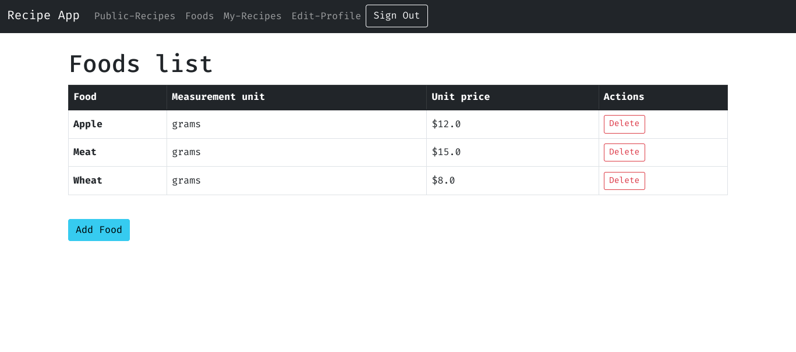
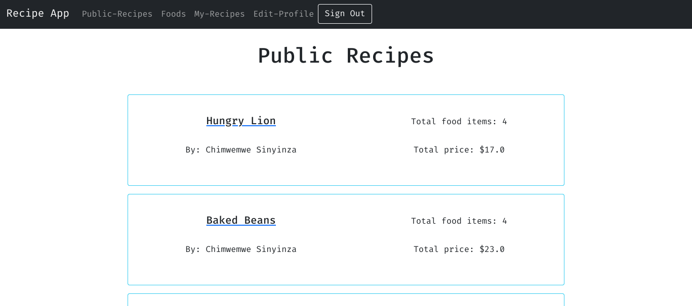
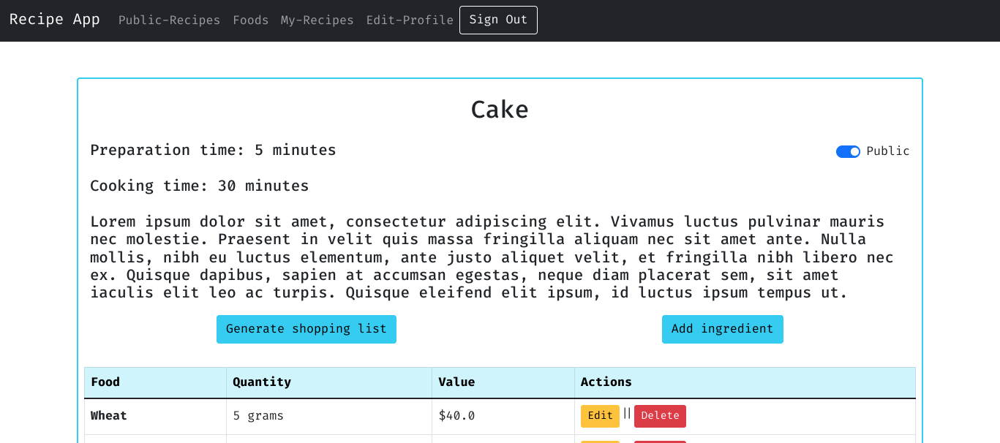
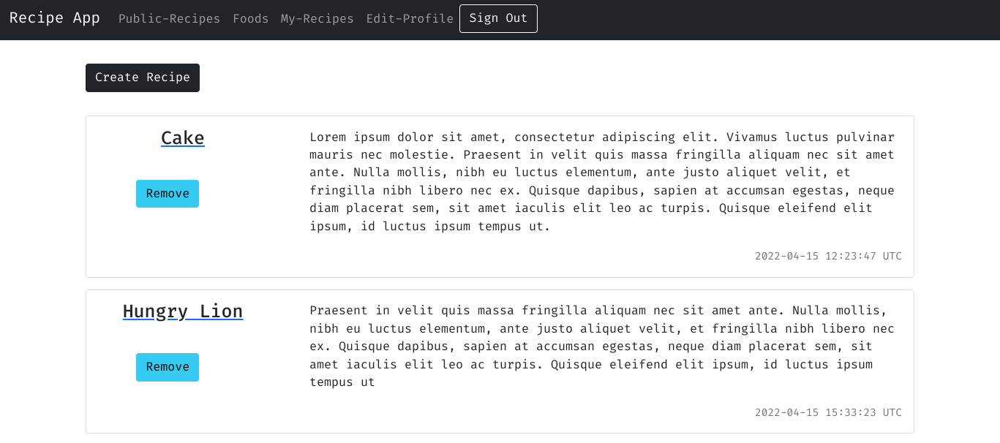

# Recipe App

The Recipe app keeps track of all your recipes, ingredients, and inventory. It will allow you to save ingredients, keep track of what you have, create recipes, and generate a shopping list based on what you have and what you are missing from a recipe. Also, since sharing recipes is an important part of cooking the app should allow you to make them public so anyone can access them.

  Screenshots                                     |  Screenshots
:------------------------------------------------:|:---------------------------------------------------------:
      |   
:------------------------------------------------:|:---------------------------------------------------------:
     |   

# Getting Started


_To get a local copy up and running follow these simple steps._

1. Clone the repo
   ```sh
   git clone https://github.com/your_username_/Project-Name.git
   ```
2. Goto project directory
   ```sh
   cd recipe-app
   ```

3. Configure `database.yml` in the config folder according to your postgreSQL configuration
4. Run app
   ```sh
   rails server
   ```
   or
   ```sh
   rails s
   ```


# Testing

`bundle exec rspec` will run all the tests.

Also, you can run `bundle exec rspec spec/` to run specific tests.

You can also run `RAILS_ENV=test rspec spec/` to run the tests in test mode.

## Errors

If you encounter any errors, run the following commands.

- Run `rails db:drop db:create db:migrate` to drop, create and migrate a new database.

- Run `rubocop && rubocop -A` to check for and fix code errors.

# This project was built with

- Ruby on Rails

- PostgreSQL

- Bootstrap CSS Framework

# Authors

👤 **Chimwemwe-127001**

- Github : [@Chimwemwe-127001](https://github.com/Chimwemwe-127001)

- Twitter : [@chimwewme](https://twitter.com/chimwewme)

- LinkedIn: [LinkedIn](https://www.linkedin.com/in/chimwewme-sinyinza)

👤 **KingsleyIbe**

- GitHub: [@KingsleyIbe](https://github.com/KingsleyIbe)

- Twitter: [LinkedIn](https://twitter.com/ibekingsley2)

- LinkedIn: [LinkedIn](https://www.linkedin.com/in/kingsley-ibe/)

# 🤝 Contributing

Contributions, issues, and feature requests are welcome!

Feel free to check the [issues page](https://github.com/Donard97/recipe-app/issues).

# Show your support

Give a ⭐️ if you like this project!

# Acknowledgement

- Hat tip to anyone whose code was a source of inspiration.
- A big thanks to [@microverseinc](https://github.com/microverseinc).

# 📝 License

This project is [MIT](./MIT.md) licensed.